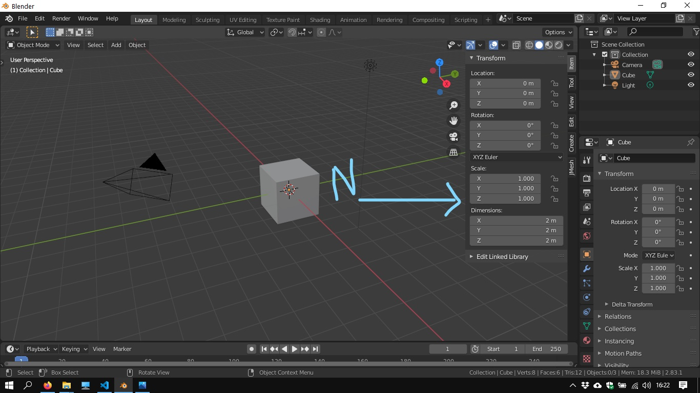
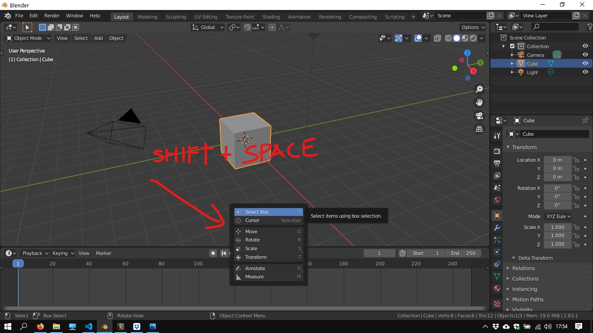
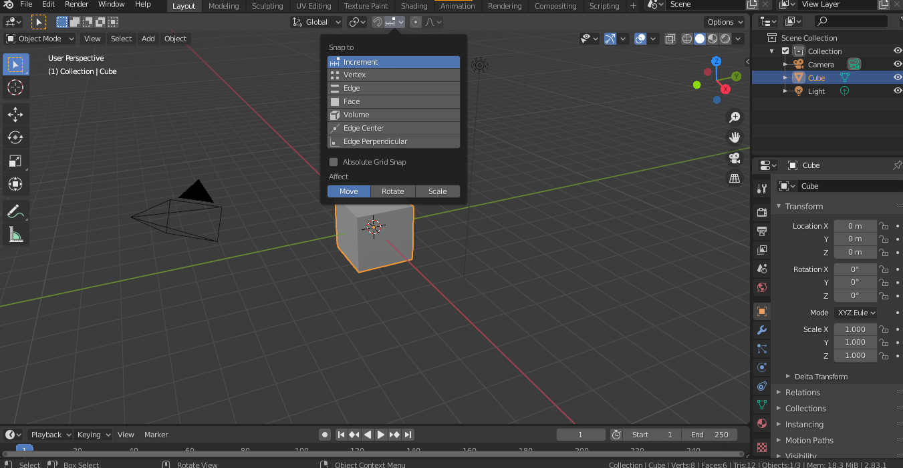
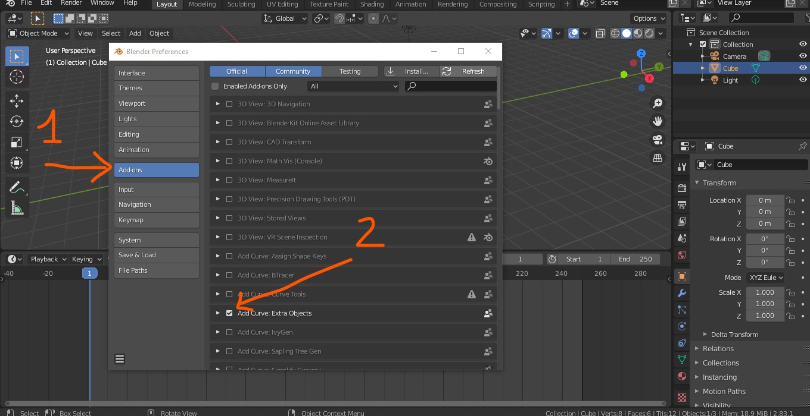

# Introdução ao Blender

## Vídeos de apresentação

### Tour pelo Blender Studio

<iframe width="560" height="315" src="https://www.youtube.com/embed/mf2uAJepT44" frameborder="0" allow="accelerometer; autoplay; clipboard-write; encrypted-media; gyroscope; picture-in-picture" allowfullscreen></iframe>

### Entrevista com  Ton Roosendaal, o criador do Blender

<iframe width="560" height="315" src="https://www.youtube.com/embed/qJEWOTZnFeg" frameborder="0" allow="accelerometer; autoplay; clipboard-write; encrypted-media; gyroscope; picture-in-picture" allowfullscreen></iframe>

## Interface

[Documentação](https://docs.blender.org/manual/en/2.83/interface/index.html#user-interface)

1. Menu do programa (application menu)
2. Workspaces
3. Controles de cena e camadas de visibilidade (Scene and View Layer selection)
4. Editores

Abas servem para trocar entre diferentes configurações de editores.

________________
## Editores

[Documentação](https://docs.blender.org/manual/en/2.83/editors/index.html#editors)

  1. 3d viewport
  2. Outliner
  3. Properties
  4. Timeline

O atalho ``ctrl + space`` maximiza o editor atual ou retorna para a vista padrão da aba.

________________

## Painéis T e N

Alguns editores possuem pequenas setas nos lados de duas áreas. Menus podem ser abertos clicando e arrastando nas setas, ou pelos atalhos ``T`` e ``N``.

Abaixo Vemos a indicação das setas no editor 3d Viewport.

No Lado esquerdo, temos o painel de ferramentas (tools panel) que pode ser visto ou escondido teclando ``T``.

No lado direito temos o painel lateral (Sidebar panel), que pode ser mostrado ou recolhido também pela tecla ``N``(como muitos dos ajustes são numéricos, a equipe do Blender escolheu a tecla ``N`` como atalho para este painel)

É comum encontrar estes paineis referidos como ``T`` e ``N`` nos materiais de informação sobre o blender.

Uma outra versão do painel T pode ser vista pressionando as teclas ``shift + space``. 

Uma tabela com botões aparece na posição do ponteiro do mouse, apresentando os mesmos botões do painel de ferramentas. 

________________

## Modos de Trabalho do Editor 3D Viewport

Os modos de trabalho ([object modes](https://docs.blender.org/manual/en/2.83/editors/3dview/modes.html#object-modes) podem ser selecionados pela barra superior esquerda do editor 3d viewport.

Selecione um dos objetos da cena e clique na seta do seletor de modos como na figura acima.

Apenas dois modos de objeto serão apresentados neste momento, **Object Mode** e o **Edit Mode**. A tecla ``Tab`` alterna automaticamente entre estes dois modos.

**Observação:** note que, quando mudamos de modo os painéis mostram algumas opções diferentes.

_______________

## Precisão (snaps & pivots)

Comandos de precisão do Blender.

Pontos pivots de transformação do Blender.

________________

## Adições (add-ons)

Acima vemos uma das maneiras de se abrir o menu de preferências.

Na opção Add-ons podemos ver uma série de adições que já vem embarcadas no Blender e podemos instalar outras, baixadas da internet. Alguns são gratuitos e outros pagos.

##### Add-ons sugeridos (gratuitos - disponíveis na internet):

  1. [CAD transformations](https://github.com/s-leger/blender_cad_transforms)
  1. [Sverchok](https://github.com/nortikin/sverchok/)
  1. [Sorcar](https://github.com/aachman98/Sorcar)
  1. [Blender Gis](https://github.com/domlysz/BlenderGIS)
  1. [Blender Bim](https://blenderbim.org/)
  1. [Point Cloud vizualizer](https://github.com/uhlik/bpy#point-cloud-visualizer-for-blender-280)
  1. [QBlocker](https://blender-addons.org/qblocker-addon/)
  1. [Jmesh](https://github.com/jayanam/jmesh-tools)

_______________

## Sistemas de coordenadas

1. Global
2. Local
3. Normal
4. Gimbal
5. view
6. Cursor
7. Adicionar outros

________________