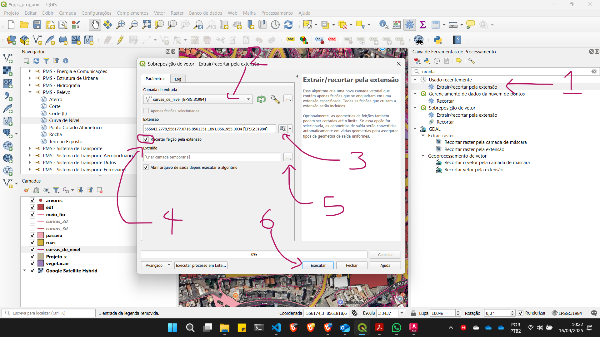

# Introdução ao Qgis

[Tutorial em vídeo - aquisição de dados urbanos de Salvador](https://www.youtube.com/watch?v=E5oui9HujCo&list=PLdvIeM1XzOJD2vrax4LrkqgRYhkU8hL58)

[Playlist das aulas Gravadas](https://www.youtube.com/watch?v=bz2w0AJURKE&list=PLdvIeM1XzOJAp-ohliu_Wa5CuupuiKrAx)

## O que é o QGIS?

O QGIS (anteriormente conhecido como Quantum GIS) é um software livre e de código aberto, multiplataforma, que atua como um Sistema de Informação Geográfica (SIG), permitindo a visualização, edição, análise e criação de mapas com dados georreferenciados. Desenvolvido inicialmente por Gary Sherman em 2002, tornou-se um projeto incubado na Open Source Geospatial Foundation (OSGeo) em 2007. Em 2013, com o lançamento da versão 2.0, o nome foi oficialmente alterado para QGIS para evitar confusão entre os nomes.

O software é amplamente utilizado por profissionais em áreas como planejamento urbano, gestão ambiental e engenharia, devido à sua flexibilidade, interface amigável e extensibilidade. Ele funciona em diversos sistemas operacionais, incluindo Windows, Linux, Mac OS X, Unix e Android (em versão beta). O QGIS suporta uma grande variedade de formatos de dados vetoriais e raster, como shapefiles, GeoJSON, PostGIS, MapInfo, dxf e imagens georreferenciadas, além de permitir conexão com bancos de dados espaciais e serviços web como WMS e WFS.

O QGIS é licenciado sob a GNU GPL, o que permite seu uso, modificação e distribuição gratuitamente. Sua funcionalidade é ampliada por uma vasta comunidade de desenvolvedores voluntários que contribuem com plugins, correções de bugs e documentação. A plataforma permite operações de geoprocessamento, como buffer, interseção e união, além de suportar análises espaciais, temporais e a criação de mapas temáticos com personalização de simbologia e rotulagem. O software também integra-se com outras ferramentas de código aberto, como GRASS GIS e PostGIS, potencializando suas capacidades analíticas.

## Site oficial

[https://qgis.org/](https://qgis.org/)

## Página de download

[https://qgis.org/download/](https://qgis.org/download/)

## Interface e arquivos

[Interface e Arquivos](./qgis_interface.md)

## Mapas do Google

[Mapas do Google](./qgis_xyz_google.md)

## Cartografia da Prefeitura de Salvador

[Serviços de Cartografia da PMS](./Cartografica_PMS.md)

## Como recortar uma camada para a extensão da tela

## Edital Av1

[Edital](editais/edital_av1.md)

